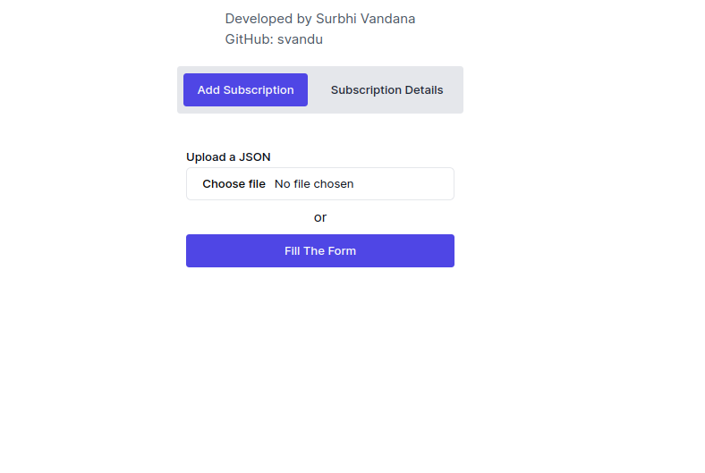

# BITO_ASSIGNMENT_SurbhiVandana Frontend

This is the frontend of the Bito Assignment

## Getting Started



To get a local copy up and running follow these simple steps.

### Installation

1. Clone the repo
   ```sh
   git clone git@github.com:svandu/BITO_Assignment_SurbhiVandana-fe.git

### Navigate to our project directory 
```sh
    cd BITO_Assignment_SurbhiVandana-fe
```

### Install npm packages
```sh
    npm install
```

## Development

### To start the development server, run:

```sh
    npm run dev
```

### our application will be running at `http://localhost:3000.`
